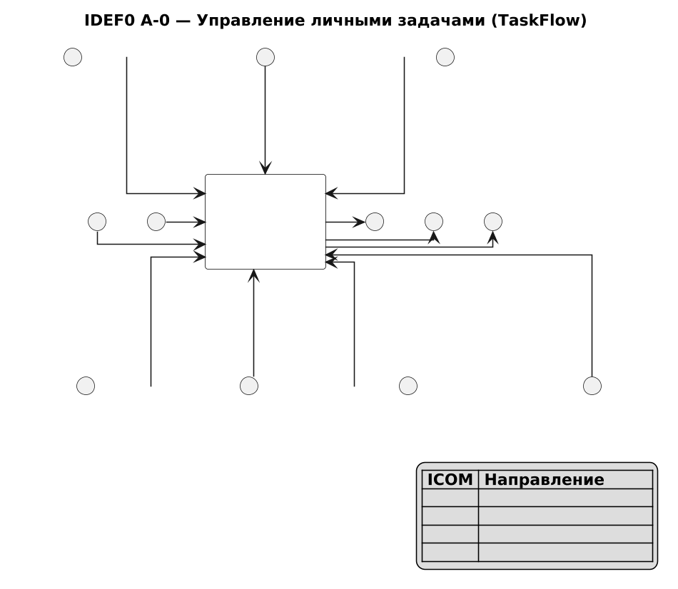

# Диаграмма бизнес-контекста (IDEF0 A-0)

## Пояснение

Диаграмма IDEF0 уровня A-0 представляет систему **TaskFlow** как единый функциональный блок «Управление личными задачами».

**Входы (слева):** учётные данные пользователя; атрибуты задачи (название, срок, приоритет, категория).

**Управление (сверху):** бизнес-правила приложения; стандарты REST/JWT/OpenAPI; архитектурный паттерн PCMEF.

**Выходы (справа):** список задач и календарь; уведомления о дедлайнах; отчёт о выполнении.

**Механизмы (снизу):** Android-клиент TaskFlow; сервер Spring Boot; СУБД PostgreSQL/H2; JWT-сервис аутентификации.

Исходник: [plantuml/idef0.puml](../plantuml/idef0.puml)
